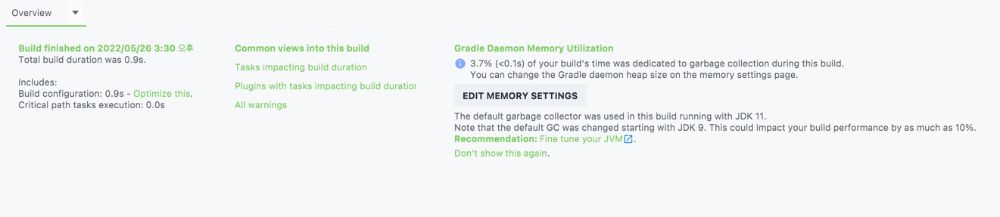
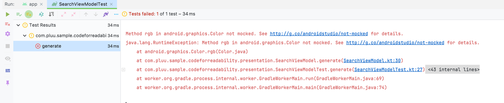
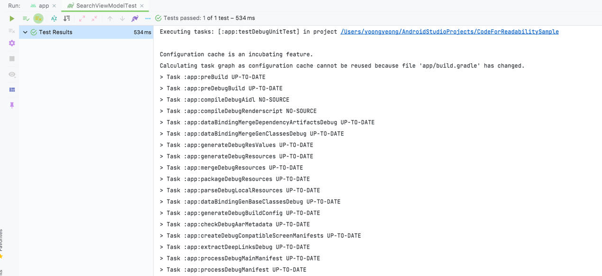

# [Sample] Code for Readability

### 구현해야하는 스펙

1. 랜덤으로 생성된 텍스트/색상을 표시하는 리스트를 만든다
2. 항목 선택시, 해당 항목에 `⭑` 표시가 되어야한다
3. 마지막으로 선택된 항목이 존재하는 경우에는 아래 조건을 대응해야한다
   1. 초기화 후 새로운 항목 노출시에도 마지막 선택된 값과 동일한 경우 `2번` 조건을 대응해야한다.

------

## Step1 : Remove Always run task

`build.gradle`에 `buildField`의 값이 **매번 계산해야 되는** 값으로 설정이 되어있었다.
System 타임을 불러오도록 되어있었는데, 이 값을 정적인 값으로 (123) 바꾸고 다시 Build 하면 아래와 같은 결과가 나온다.

 > 학습한 내용 

### Gradle Build output
Gradle 이 작업을 실행할 때 콘솔 UI 와 Tooling API를 통해 다른 결과로 작업에 레이블을 저장할 수 있다.
이러한 레이블은 작업에 실행할 작업이 있는지, 해당 작업을 실행해야 하는지, 해당 작업을 실행해야 하는지, 해당 작업을 실행했는지,
해당 작업이 변경되었는지 여부를 기반으로 한다.

#### `(no label)` or `EXECUTED`
Task가 해당 작업을 실행했다.
- Task에는 Action이 있고 Gradle은 빌드의 일부로 실행되어야 한다고 결정하였다.
- Task는 작업과 일부 종속성이 없으며 종속성이 모두 실행된다.

#### `UP-TO-DATE`
Task의 출력은 변경되지 않았다.
- Task에는 출력과 입력이 있으며 변경되지 않았다.
- Task에는 Action이 있지만 Gradle에 출력을 변경하지 않았다고 알려준다.
- Task에는 Action과 일부 종속성이 없지만 모든 종속성은 최신 상태이며 건너뛰거나 캐시에서 가져온다.
- Task에는 Action과 종속성이 없다.

#### `FROM-CACHE`
Task의 출력은 이전 실행에서 찾을 수 있다.
- Task에 빌드 캐시에서 복원된 출력이 있다.

#### `SKIPPED`
Task가 해당 작업을 실행하지 않았다.
- Task가 명령줄에서 명시적으로 제외 되었다.
- 작업에 `OnlyIf` 조건자가 `false`를 반환한다.

#### `NO-SOURCE`
Task는 해당 Action을 실행할 필요가 없다.
- Task에는 입력과 출력이 있지만 소스는 없다. 예를 들어, 소스 파일은 JavaCompile용 .java 파일이다.

[참고 자료 - Gradle page](https://docs.gradle.org/current/userguide/more_about_tasks.html)

## Step2 : Unnecessary, gradle options

1) `multiDexEnabled true`

min 21에서 불필요한 옵션이다.  
[공식문서](https://developer.android.com/studio/build/multidex#mdex-on-l)에 따르면
Android 5.0 이상에서는 **멀티 덱스** 를 지원한다고 명시되어 있다.
따라서 삭제를 해준다.

2) `vectorDrawables.useSupportLibrary = true`

위와 마찬가지로 min 21에서 불필요한 옵션이다.  
[공식문서](https://developer.android.com/studio/write/vector-asset-studio?hl=ko#sloption)에 따르면
Android 5.0 (API 버전 21) 아래에서 Vector 이미지를 사용할 수 있게 해주는 지원 라이브러리이다.
따라서 삭제를 해준다.

3) `dataBinding true`

해당 앱에서는 `viewBinding`을 사용하고 `dataBinding`은 사용하지 않는다.
필요하지 않은 옵션은 삭제해주었다. 

4) `coreLibraryDesugaring 'com.android.tools:desugar_jdk_libs:1.1.5'`

dusugar는 필요한 경우에만 추가한다.
하지만 해당 앱에서는 필요한 부분이 없기 때문에 삭제 해주었다!

[공식문서 참고](https://developer.android.com/studio/write/java8-support)  
[Android 호환성 유지에 대한 고찰 ~ 언어편 _pluu](https://developer.android.com/studio/write/java8-support)

5) Optimize 빌드 옵션 추가하기

## Step3 : move network

기존에는 네트워크 통신부가 `activity`에 위치해 있었다.
이를 `viewModel`로 옮겨준다.

## Step4 : move generate item

옵저버 패턴을 이용해서 뷰를 최대한 수동적으로 만들어준다.
라이브 데이터를 이용하여 구현한다.

데이터에 대한 처리는 모두 뷰모델에서 담당해준다.
어댑터에서도 sorting 등에 대해 신경쓰지 않고 데이터를 교체해주는 작업만 하면 된다!

## Step5 : test viewmodel pre

Unit Test로 ViewModel을 테스트 해본다!
테스트 코드를 작성하면서 테스트 하기 어려운 코드를 짠 것은 아닌지 검토해볼 수도 있다.

라이브 데이터 테스트를 위해 
[공식문서 : Arch Core](https://developer.android.com/jetpack/androidx/releases/arch-core)와
[Medium : Unit-testing LiveData and other ...](https://medium.com/androiddevelopers/unit-testing-livedata-and-other-common-observability-problems-bb477262eb04)
를 참고하였다!

테스트 실행 결과는 아래와 같다!

이를 해결하는 것을 다음 step에서 해보자!

## Step6 : test viewmodel

Step 5에서 오류가 난 부분을 수정해보자!
Color가 mock 되어있지 않다?

그래서 Color를 넣어주는 부분을 빼주었다!
그리고 mock Sample Item을 생성해주고~ 테스트코드에서 ViewModel을 생성할 때 넣어주고 테스트를 돌리는 것!!
(근데 테스트에 대해 자세한 부분은 `mokito`를 공부해야 될 것같다!!)

그리고 나머지 코드는 [공식문서의 Inject TestDispatchers in tests](https://developer.android.com/kotlin/coroutines/coroutines-best-practices#test-coroutine-dispatcher)
를 참고해서..!

## Step7 : move favorite

`MainActivity`에서 preference를 저장한다.
이는 뷰의 관심사와는 다소 거리가 멀다.
로컬에 저장한다는 것을 뷰가 꼭 알아야 하는 정보가 아니다. 오히려 모르는 편이 좋다.

또한, context를 사용해야하는데 이때 context를 넘기지 않고 `repository`를 넘겨준다!

## Step8 : add item ui state

`onFavorite`를 data class에 넣어 사용하고 User event를 처리할 때 신경 써줘야 할 부분을 더 잘?? 처리할 수 있었다. 
[공식문서](https://developer.android.com/topic/architecture/ui-layer/events#recyclerview-events)에 따르면
이렇게 했을 경우 `recyclerview` 어댑터가 필요한 데이터만 사용할 수 있었다!
어댑터가 전체 ViewModel에 액세스할 수 없으므로 ViewModel에 의해 노출된 기능을 악용할 가능성이 낮다.

## Step9 : item manager for repository

뷰 모델에서 데이터를 보관? 캐싱하는게 맞는가..? 
데이터 보관을 ViewModel 대신에 다른 곳에 맡긴다면..!
추후, 데이터 저장을 서버로 이관한다면??

`repository`를 이용하여 해결해보자!

나중에 데이터 저장을 서버로 이관하거나, room을 사용하더라도 일관되게 처리할 수 있을 것이다!

## Step10 : add, ViewModelProvider Factory

ViewModelProvider Factory를 사용해서 개선해보자!
생성자로 다 만들었지만 generate 된게 많다..!
DI랑 Hilt를 쓰면 코드를 보기 좋다.. 

생성자에 repository를 너무 많이 넣는듯 한..!
이는 Hilt를 공부하면 적용해보는걸로 하자!