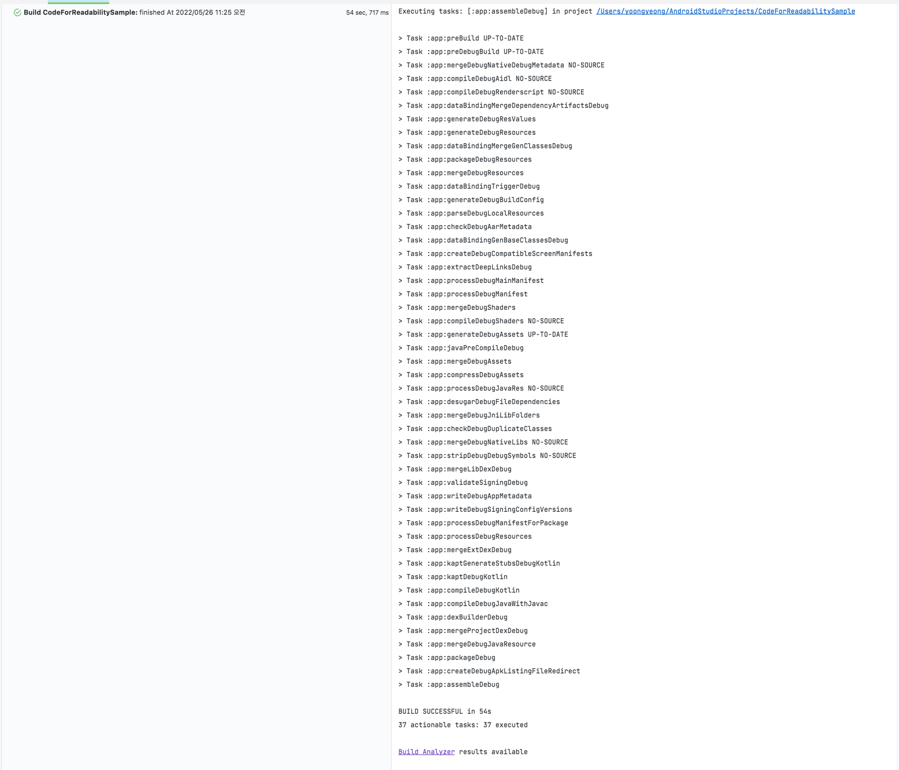
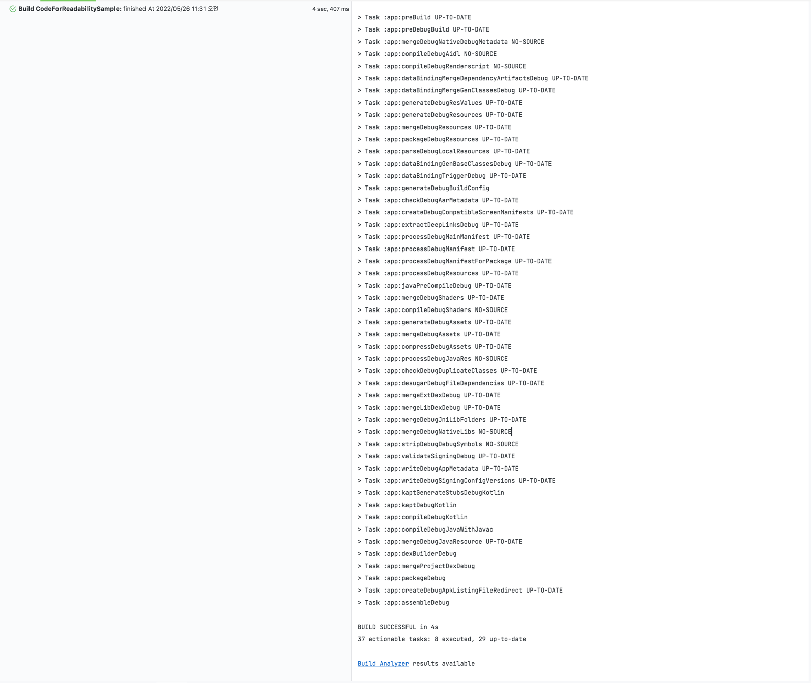
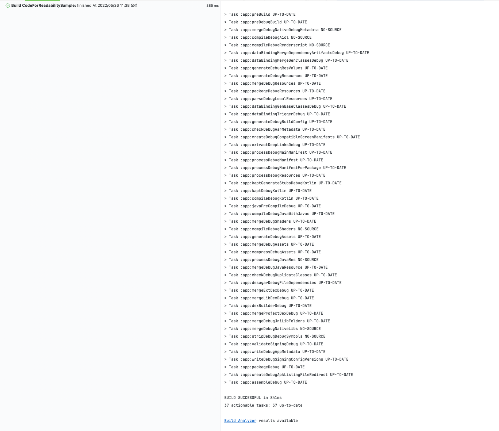

# [Sample] Code for Readability

### 구현해야하는 스펙

1. 랜덤으로 생성된 텍스트/색상을 표시하는 리스트를 만든다
2. 항목 선택시, 해당 항목에 `⭑` 표시가 되어야한다
3. 마지막으로 선택된 항목이 존재하는 경우에는 아래 조건을 대응해야한다
   1. 초기화 후 새로운 항목 노출시에도 마지막 선택된 값과 동일한 경우 `2번` 조건을 대응해야한다.

------

## Step1 : Remove Always run task

`build.gradle`에 `buildField`의 값이 **매번 계산해야 되는** 값으로 설정이 되어있었다.
System 타임을 불러오도록 되어있었는데, 이 값을 정적인 값으로 (123) 바꾸고 다시 Build 하면 아래와 같은 결과가 나온다.

 ð 학습한 내용 

### Gradle Build output
Gradle 이 작업을 실행할 때 콘솔 UI 와 Tooling API를 통해 다른 결과로 작업에 레이블을 저장할 수 있다.
이러한 레이블은 작업에 실행할 작업이 있는지, 해당 작업을 실행해야 하는지, 해당 작업을 실행해야 하는지, 해당 작업을 실행했는지,
해당 작업이 변경되었는지 여부를 기반으로 한다.

#### `(no label)` or `EXECUTED`
Task가 해당 작업을 실행했다.
- Task에는 Action이 있고 Gradle은 빌드의 일부로 실행되어야 한다고 결정하였다.
- Task는 작업과 일부 종속성이 없으며 종속성이 모두 실행된다.

#### `UP-TO-DATE`
Task의 출력은 변경되지 않았다.
- Task에는 출력과 입력이 있으며 변경되지 않았다.
- Task에는 Action이 있지만 Gradle에 출력을 변경하지 않았다고 알려준다.
- Task에는 Action과 일부 종속성이 없지만 모든 종속성은 최신 상태이며 건너뛰거나 캐시에서 가져온다.
- Task에는 Action과 종속성이 없다.

#### `FROM-CACHE`
Task의 출력은 이전 실행에서 찾을 수 있다.
- Task에 빌드 캐시에서 복원된 출력이 있다.

#### `SKIPPED`
Task가 해당 작업을 실행하지 않았다.
- Task가 명령줄에서 명시적으로 제외 되었다.
- 작업에 `OnlyIf` 조건자가 `false`를 반환한다.

#### `NO-SOURCE`
Task는 해당 Action을 실행할 필요가 없다.
- Task에는 입력과 출력이 있지만 소스는 없다. 예를 들어, 소스 파일은 JavaCompile용 .java 파일이다.

[참고 자료 - Gradle page](https://docs.gradle.org/current/userguide/more_about_tasks.html)

